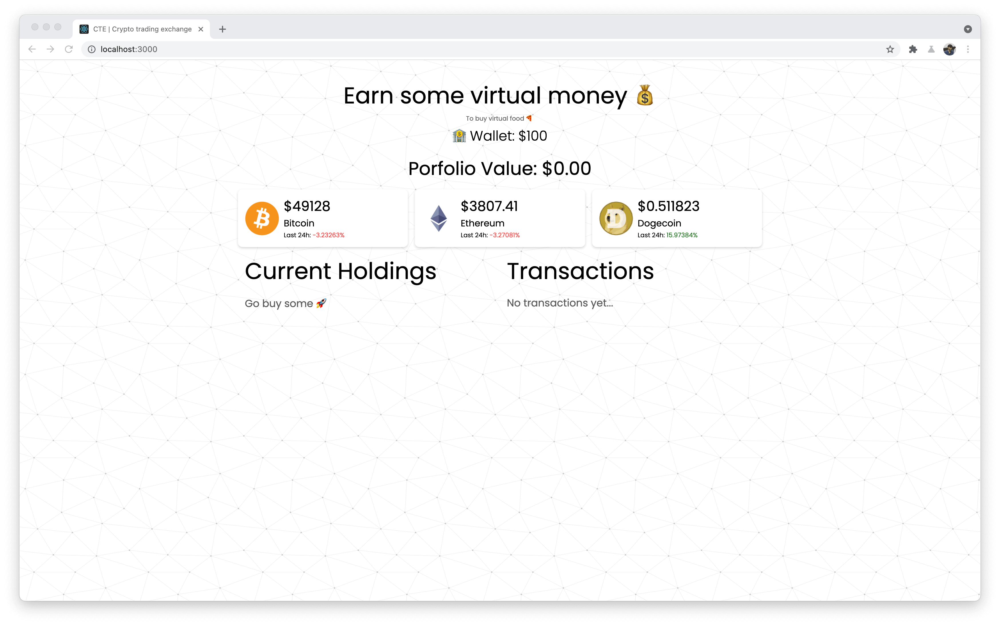
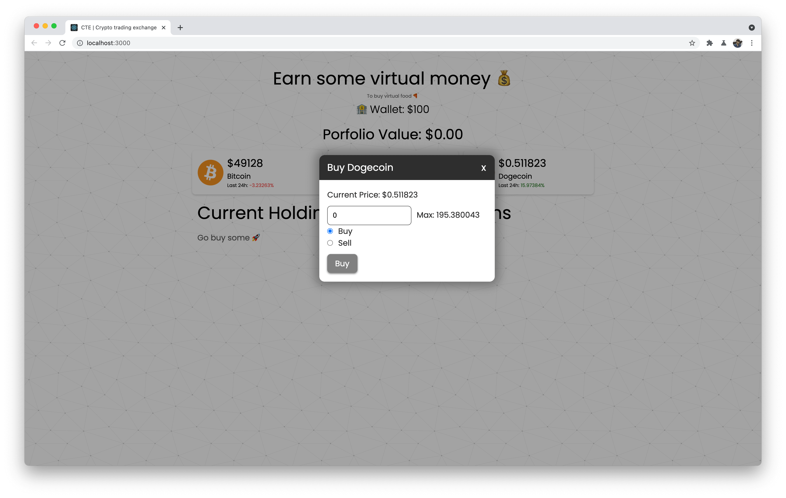
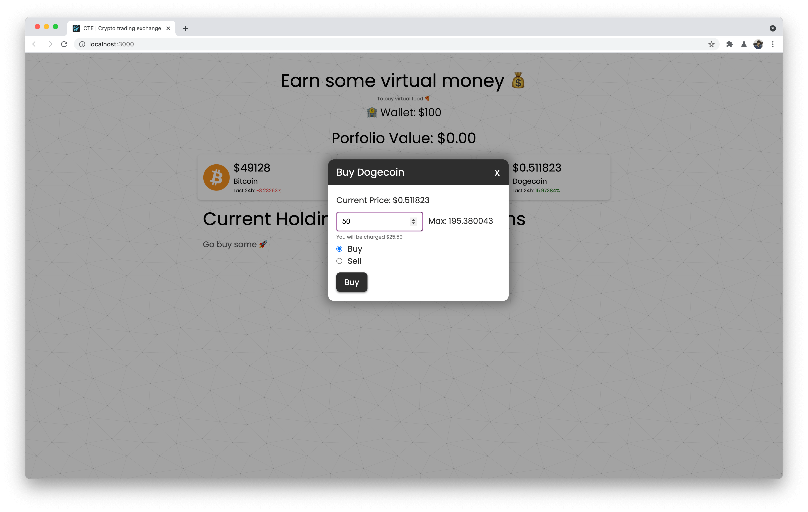
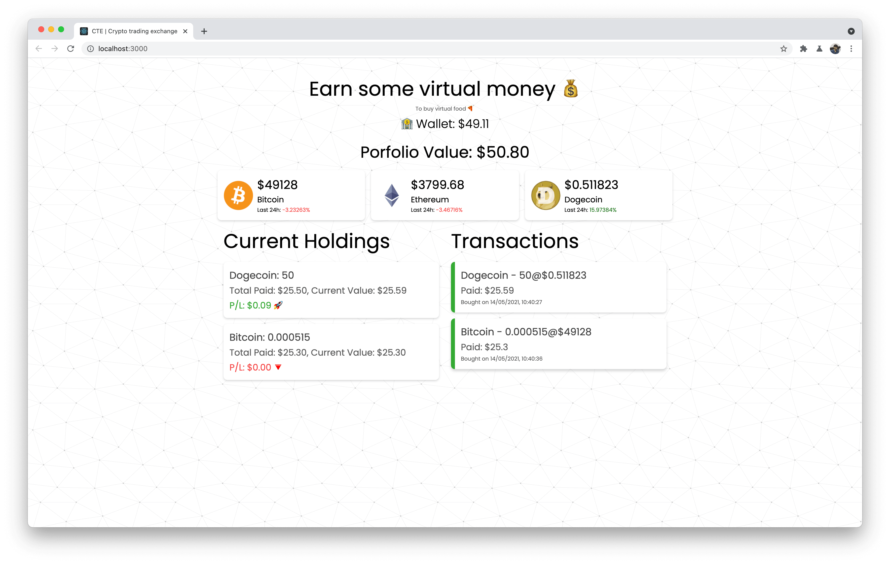
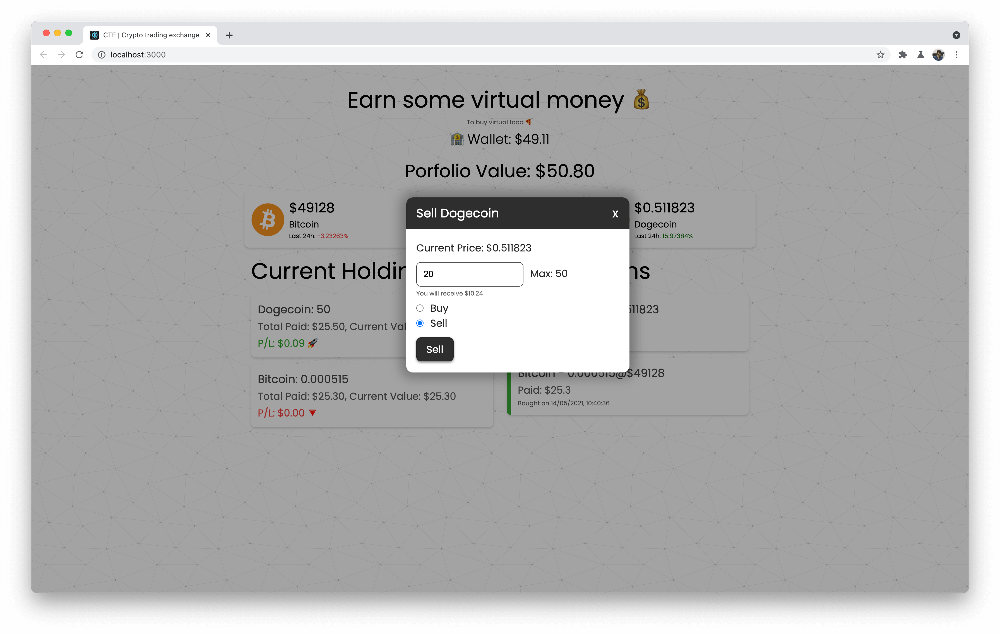
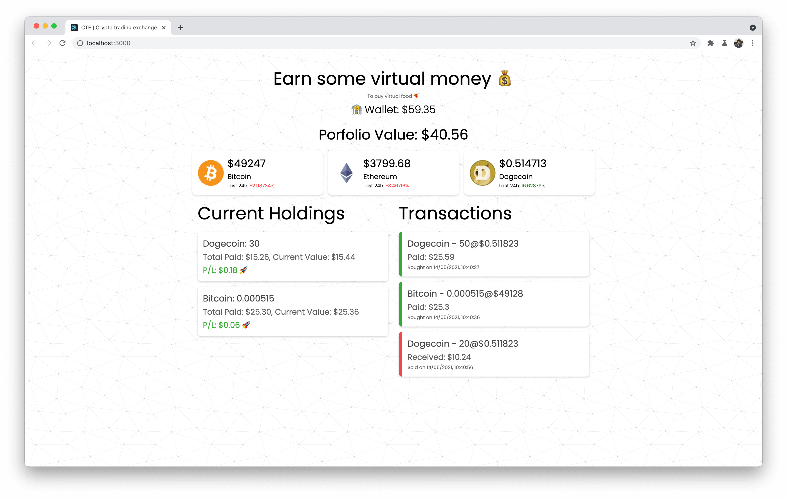

# Crypto Trading Simulator
 
We will be making a fully functional trading simulator. You should be able to:
- See prices of top currencies
- Buy crypto assets
- Sell crypto assets
- See your holdings
- See your order history

[API Used](https://www.coingecko.com/en/api#explore-api)

## Discussion points (Needs to be filled by your team):
- What are the components you will be creating?
- How the information will be flowing in the app?
- Flow diagram?

### Style Guide
- Poppins
- Color shades you can choose
- Background svg is available inside public folder

### Screenshots

### App Demo
[Link to video](./screenshots/crypto-demo.mp4)
